# 便携式指针式仪表数据智能读取装置总体技术方案

## 一、引言​

### 1.1 项目背景​
在工业 4.0 与智能制造蓬勃发展的时代浪潮下，工业生产领域的数字化、智能化转型成为必然趋势。指针式仪表作为工业生产过程中监测压力、温度、流量等关键参数的核心设备，其数据的准确性和实时性直接决定着生产安全与效率。然而，传统的人工巡检读数方式，已成为制约工业智能化进程的显著瓶颈。


### 1.2 项目目标​

#### 1.2.1 技术精度目标
##### 识别精度目标
- 读数误差在±4%范围内的识别准确率≥95%，确保在复杂工业环境下的稳定识别

##### 精度评估方法：
- 读数误差计算：读数误差 = |识别读数 - 标准读数| / 量程 × 100%
- 准确率计算：准确率 = 读数误差在±4%范围内的样本数 / 总样本数 × 100%
  
##### 验证方法示例：
- 某压力表量程为10MPa，标准读数为6MPa，识别读数为6.3MPa
- 读数误差 = |6.3 - 6| / 10 × 100% = 3% < 4%，判定为正确识别
- 在100次测试中，若有95次误差在±4%以内，则准确率 = 95/100 = 95%，达到精度目标
  

#### 1.2.2 性能目标  
- 识别响应速度：单次仪表识别响应时间≤3秒，支持实时数据采集需求
- 设备续航能力：≥3小时，支持全天候连续作业需求
- 环境适应性目标：设备在-10℃~+35℃温度范围内正常工作


## 二、需求分析

### 2.1 功能需求分析

#### 2.1.1 手持终端识别功能需求
- 仪表检测与定位：自动检测图像中的指针式仪表位置，支持单张图像多仪表检测
- 指针式仪表类型识别：准确识别指针式压力表、温度表、流量表、液位表等不同测量参数的仪表
- 量程自动识别：自动识别仪表量程范围，支持不同刻度单位（MPa、℃、m³/h等）
- 指针读数识别：精确识别指针位置并计算对应数值，专注于指针式仪表的高精度识别
- 图像预处理：自动调整图像亮度、对比度、去噪等，适应复杂光照环境
- 离线识别能力：支持网络断开情况下的本地识别处理

#### 2.1.2 后台数据管理功能需求
- 数据存储管理：建立完整的仪表数据存储体系，支持海量数据存储
- 设备档案管理：维护完整的仪表设备档案，包括设备型号、安装位置、维护记录等
- 用户权限管理：支持多级用户权限设置，确保数据访问安全
- 历史数据查询：支持按时间、设备、区域等多维度条件查询历史数据

#### 2.1.3 数据统计分析功能需求
- 实时数据监控：实时显示关键仪表的当前状态和数值
- 异常检测：自动识别数据异常和设备故障，及时预警
- 统计报表生成：自动生成日报、周报、月报等各类统计报表

#### 2.1.4 数据可视化分析功能需求
- 仪表盘展示：提供直观的数据仪表盘，实时展示关键指标
- 图表分析：支持折线图、柱状图、饼图、热力图等多种图表展示
- 导出功能：支持图表和报表的导出，包括PDF、Excel、图片等格式

## 三、技术可行性分析

### 3.1 关键技术可行性


#### 3.1.1 指针式仪表识别技术在工业场景的适用性  
技术现状：指针式仪表识别技术基于深度学习的多模型融合架构，在复杂工业环境下表现优异。
- PPYOLOE-Plus技术：目标检测准确率达到96%以上，有效定位指针式仪表区域并识别仪表类型
- HRNet关键刻度定位：高分辨率网络精确定位关键刻度区域，像素级准确率达到98%
- PPOCRv3技术：针对仪表刻度数字的OCR识别，在复杂背景下准确率达到97%以上
- OCRNet指针分割：基于对象上下文表示的网络，精确分割指针区域
- 抗干扰能力：支持多角度、强光、阴影等复杂环境下的稳定识别
- 工业验证：已在石油化工、电力、钢铁等行业的指针式仪表场景验证可行性
- 可行性评估：技术成熟，算法架构完整

#### 3.1.2 边缘计算设备性能与功耗平衡分析
硬件选型分析：
- NVIDIA Jetson AGX Xavier（16GB版本）：算力21 TOPS，功耗10-15W，满足便携式要求
- 处理能力：支持同时运行多个AI模型
- 功耗控制：采用ARM架构，功耗较传统x86设备降低70%
- 散热设计：被动散热即可满足工业环境使用要求
- 可行性评估：硬件成熟，性能功耗平衡良好

### 3.2 技术风险评估

#### 3.2.1 复杂光照条件下的识别挑战
风险描述：工业现场存在强光、逆光、阴影等复杂光照条件，影响图像质量。
风险等级：中等
应对措施：
- 自适应曝光控制：根据环境光照自动调整相机曝光参数
- 图像增强算法：使用直方图均衡化、Gamma校正等技术改善图像质量
- 补光设备：在极端光照条件下使用补光灯

#### 3.2.2 仪表污损、老化对识别精度的影响
风险描述：长期使用的仪表可能存在表面污染、刻度模糊、指针变形等问题。
风险等级：中等
应对措施：
- 图像预处理增强：使用去噪、锐化、对比度增强等技术
- 多角度拍摄：通过多个角度拍摄提高识别成功率
- 人工校验机制：对识别结果进行人工二次确认
- 数据集扩充：收集更多污损仪表样本进行模型训练


### 3.3 技术创新点

#### 3.3.1 多模态大模型二次校验的创新性
创新价值：结合视觉识别和语言理解，提供智能化的辅助判断和异常检测。
技术优势：
- 多模态融合：结合图像信息、文本信息、历史数据进行综合分析
- 智能辅助：通过大模型的推理能力，提供异常数据检测和趋势分析
- 语义理解：能够理解仪表类型、量程、单位等语义信息，提供上下文参考
- 辅助决策：为人工复核提供智能建议，不直接影响主要识别精度指标

#### 3.3.2 便携式机械结构设计的独特性  
创新价值：创新的可折叠、模块化设计，兼顾便携性和功能性。
设计优势：
- 一体化集成：手持终端、边缘计算、通信模块一体化设计
- 可折叠结构：拍摄杆可折叠收纳，整体重量控制在5kg以内

#### 3.3.3 端云协同架构的优势分析
创新价值：边缘计算与云端服务的智能协同，平衡性能与成本。
架构优势：
- 实时响应：边缘设备本地处理，响应时间<3秒
- 智能决策：云端大模型提供复杂场景的智能分析
- 成本优化：根据任务复杂度智能分配计算资源
- 数据安全：敏感数据本地处理，降低传输风险

技术成熟度总体评估：大部分技术成熟，具备实施条件

## 四、总体设计思路​

### 4.1 系统架构概述​

#### 4.1.1 整体架构设计理念
本系统采用"端-边-云"三层协同架构，实现数据采集、边缘处理和云端分析的有机结合：

端侧（Terminal）：便携式手持终端负责图像采集和用户交互
- 高清摄像头进行仪表图像采集


边侧（Edge）：边缘计算设备承担核心AI识别任务
- 本地预处理和图像质量检测
- 部署深度学习模型进行仪表识别
- 实时图像处理和数值计算
- 本地数据缓存和离线处理能力
- 与云端的智能协同调度

云侧（Cloud）：云端服务提供数据管理和高级分析
- 海量数据存储和历史数据管理
- 大模型二次校验和智能分析
- 数据可视化和统计分析服务
- 系统监控和远程运维管理

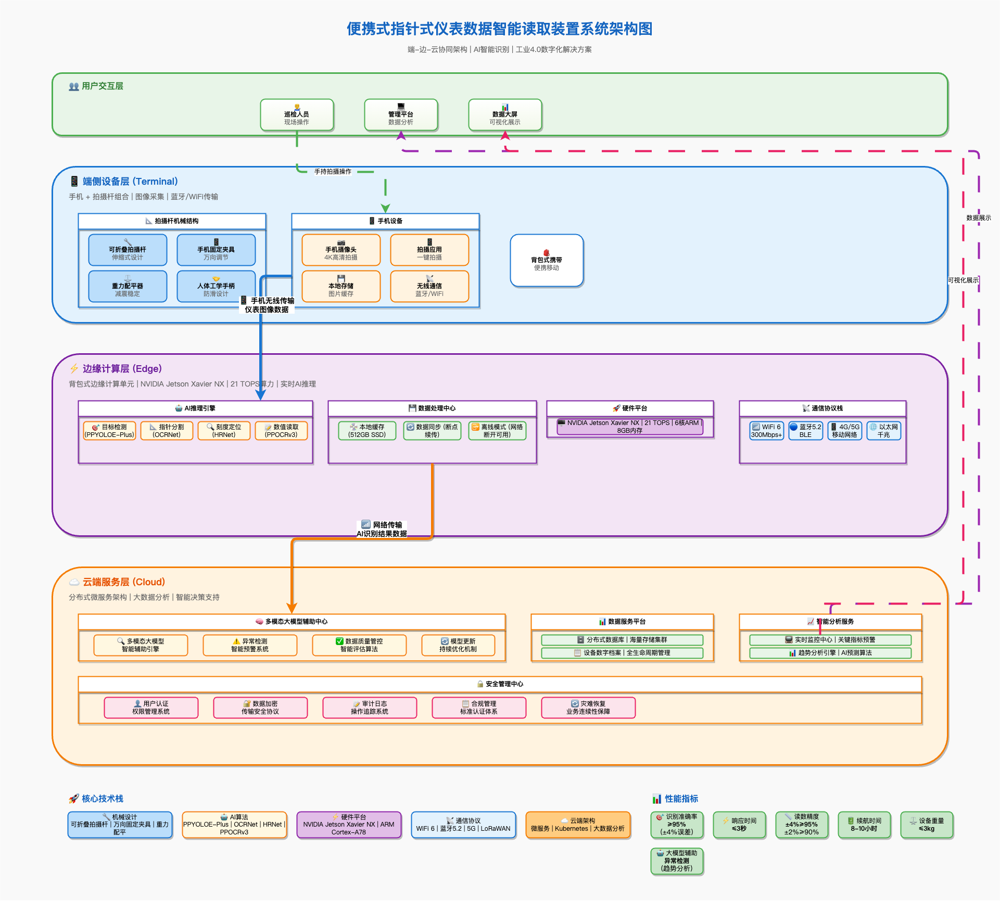

#### 4.1.2 核心功能模块
数据采集模块：
- 手机拍照：使用手机摄像头对指针式仪表进行拍摄
- 图像传输：将拍摄的图片传输至终端设备进行处理

AI识别模块：
- 目标检测子系统：基于PPYOLOE-Plus的指针式仪表位置检测、类型识别、区域分割
- 指针分割子系统：基于OCRNet的指针精确分割、角度计算
- 刻度定位子系统：基于HRNet的关键刻度区域定位
- 数值识别子系统：基于PPOCRv3的刻度数字识别、量程解析、单位转换
- 多模态辅助子系统：大模型辅助分析、异常检测提醒、智能决策建议（辅助功能）

数据处理模块：
- 图像处理：对接收的图片进行AI识别和数值计算
- 数据传输：将处理结果传输到后台管理系统
- 数据存储：本地缓存识别结果并同步到云端

应用服务模块：
- 数据管理子系统：设备档案、历史记录、查询检索
- 分析展示子系统：统计分析、趋势预测、可视化展示
- 运维管理子系统：系统监控、故障诊断、性能优化

#### 4.1.3 系统交互流程

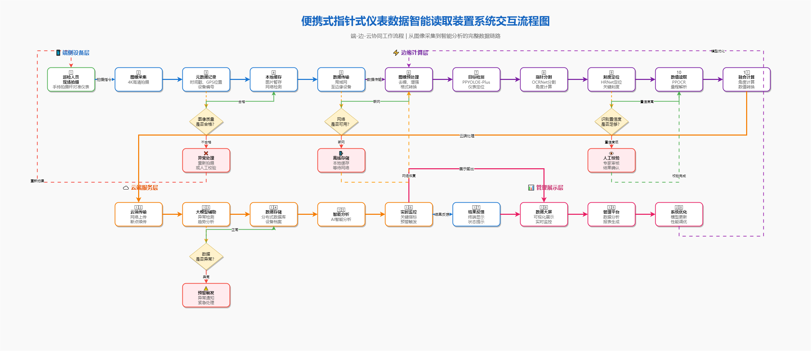

主要交互流程：
1. 数据采集阶段：
   - 用户通过手持终端对准仪表拍摄
   - 记录拍摄时间、位置等元数据信息

2. 边缘处理阶段：
   - 图像传输到背包中的边缘计算设备
   - AI模型进行指针式仪表检测、类型识别和数值读取
   - 生成初步识别结果和置信度评分

3. 云端校验阶段：
   - 识别结果上传至云端进行二次校验
   - 大模型结合历史数据进行异常检测
   - 返回最终确认结果和分析建议

4. 结果反馈阶段：
   - 识别结果实时显示在手持终端
   - 数据存储到云端数据库供后续分析

### 4.2 设计原则​

- 模块化设计原则：采用模块化架构，各功能模块独立开发，便于维护和升级。
- 可扩展性设计原则：系统支持功能扩展，可适应不同类型仪表和业务需求。
- 用户友好性设计原则：界面简洁直观，操作简单，支持离线使用。
- 安全性与可靠性设计原则：确保数据传输安全，系统运行稳定可靠。

## 五、硬件配置与选型

### 5.1 核心硬件配置

#### 5.1.1 边缘计算设备选型
推荐方案：NVIDIA Jetson AGX Xavier（16GB版本）
- AI性能：21 TOPS AI算力
- GPU规格：搭载 48 个 Tensor Core 的 384 核 NVIDIA Volta™ GPU
- CPU配置：6 核 NVIDIA Carmel ARM®v8.2 64 位 CPU，6MB L2 + 4MB L3
- 显存配置：16 GB 128 位 LPDDR4x，59.7GB/s带宽
- 存储容量：16 GB eMMC 5.1
- 功耗控制：10 瓦 | 15 瓦 | 20 瓦，支持动态功耗管理
- 视频处理：支持2x 4K60或4x 4K30编解码能力
- 接口配置：1个 x1 PCIe 3.0 + 1个 x4 PCIe 4.0，10/100/1000 BASE-T以太网
- 摄像头支持：多达6个摄像头接入，14通道MIPI CSI-2
- DL加速器：2x NVDLA，2x PVA视觉加速器
- 显示输出：2个多模DP 1.4/eDP 1.4/HDMI 2.0
- 规格尺寸：69.6毫米 x 45毫米，260引脚SO-DIMM连接器
- 使用场景：Jetson Xavier NX 适用于无人机、便携式医疗设备、小型商业机器人、智能摄像头、高分辨率传感器、自动光学检测、智能工厂和其他 IoT 嵌入式系统等高性能 AI 系统


#### 5.1.2 高清摄像头选型与配置
- todo: 给出手机型号像素等

#### 5.1.3 数据传输模块选型
数据传输方案：
- 通过局域网将手机拍摄的图片传输到边缘计算设备进行AI识别
- 处理结果通过网络连接上传至后台管理系统

#### 5.1.4 电源管理系统设计
电池配置：
- 电池类型：磷酸铁锂电池，容量15000mAh
- 电压规格：11.1V标称电压，支持快充技术
- 续航能力：连续工作2-3小时，待机大于8小时
- 充电方式：USB-C PD快充，充电功率45W


硬件规格总览：
| 组件类别 | 主要规格 | 重量 | 功耗 | 备注 |
|---------|---------|------|------|------|
| 边缘计算模块 | Jetson AGX Xavier（16GB版本） | 500g | 10-20W | AI识别处理 |
| 拍摄设备 | 手机（用户自备） | 200g | 3-5W | 图像采集 |
| 电池系统 | 15000mAh锂电池 | 800g | - | 2-3小时续航 |
| 数据传输模块 | WiFi局域网 | 50g | 2W | 图像数据传输 |
| 外壳及配件 | 背包式收纳 | 450g | - | 便携收纳 |
| 系统总重 | 全配置 | ≤2kg | ≤25W | 不含手机重量 |

## 六、手持终端机械结构设计​

### 6.1 终端形态概述​
- todo：整体效果图，比如，一个人背着包，拿着一个拍摄杆，另外一个手绑着手机，尽可能的展现形态​
- todo：不同使用场景下的终端形态变化说明​

### 6.2 机械连杆结构化设计​
- todo：设计原理​
- todo：3D 结构化设计图​

### 6.3 便携组件设计​
- todo：背包式收纳结构设计​
- todo：手持拍摄杆的可折叠设计方案​
- todo：手机绑带的调节与固定方式设计​

### 6.4 手持终端设备数据传输流程​
- todo：终端拍照流程图​
- todo：数据传输模块蓝牙/WiFi方案​

## 七、算法设计

### 7.1 边缘侧算法设计

#### 7.1.1 边缘侧算法总体框架
表计读数的识别主要分成如下三个阶段，每个阶段的流程如下图所示：

1. 目标检测阶段：使用目标检测算法对图像中的表计进行定位与分类
2. 特征提取阶段：使用检测框将表计从图像中抠出，对表盘上的刻度、数字、指针进行识别与分析  
3. 读数计算阶段：通过图像处理得到表计的读数

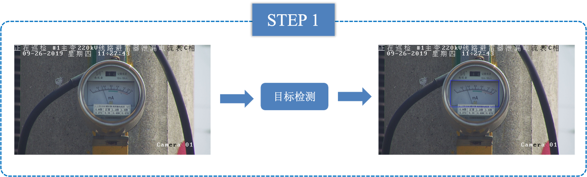
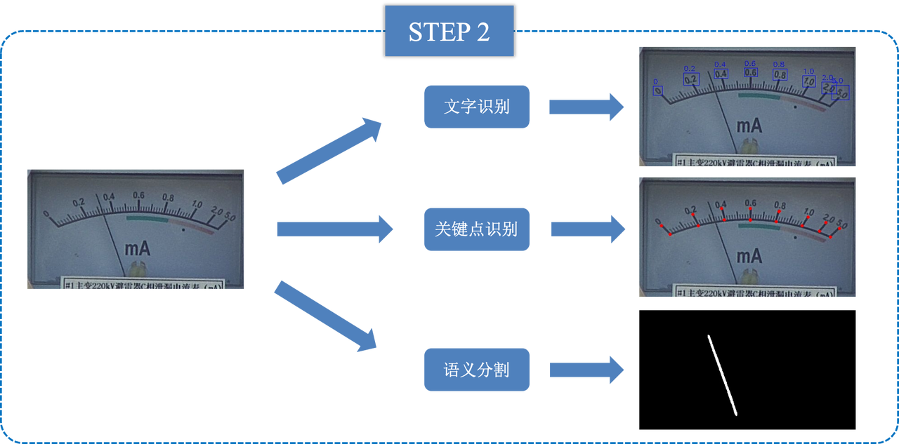
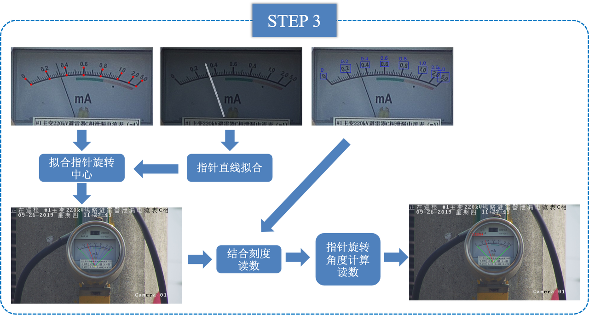

#### 7.1.2 算法原理

##### 7.1.2.1 目标检测算法
目标检测算法采用PP-YOLOE+，其网络结构如下图所示。算法采用RepResBlock模块来构建骨干网络（backbone）和特征融合网络（neck）：

网络架构特点：
- 骨干网络：由三个卷积层构成的stem和四个CSPRepResStage组成
- CSPRepResStage：主要由RepResBlock堆积而成，同时加入了ESE（Effective Squeeze and Extraction）层加强了对通道的注意力
- ET-head结构：目标检测算法的head通常由分类head和定位head组成，对其进行解耦可以提升模型精度，但完全解耦又丢失了两者存在的关联性。PP-YOLOE+提出了ET-head结构，有效的兼顾了目标框的分类和定位两个任务

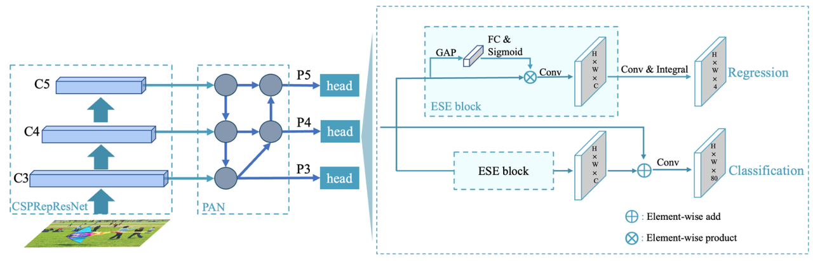

##### 7.1.2.2 语义分割算法
对指针的语义分割采用OCRNet算法实现，其主要思想是显式的把语义分割中的像素分类问题转化成物体区域分类问题，这与语义分割问题的原始定义是一致的，即每个像素的类别就是该像素属于的物体的类别。

OCRNet方法实现包括3个阶段：
1. 软物体区域生成：从骨干网络得到特征表示，并估测一个简单粗略的语义分割结果作为OCRNet方法的一个输入，即软物体区域（Soft Object Regions）
2. 物体区域表示计算：根据软物体区域和网络最深层输入的特征表示计算出K组向量，即物体区域表示（Object Region Representations），其中每一个向量对应一个语义类别的特征表示
3. 上下文特征融合：计算网络最深层输出的像素特征表示（Pixel Representations）与计算得到的物体区域特征表示（Object Region Representation）之间的关系矩阵，然后根据每个像素和物体区域特征表示在关系矩阵中的数值把物体区域特征加权求和，得到最后的物体上下文特征表示OCR (Object Contextual Representation)

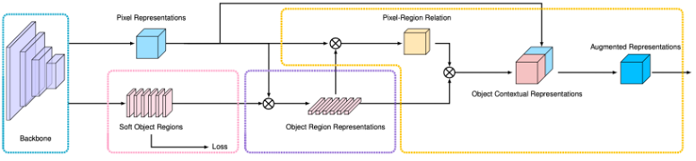

##### 7.1.2.3 关键点检测算法
刻度关键点检测采用HRNet算法实现，该算法可以在整个特征提取的过程中保持高分辨率的特征表示。

HRNet算法特点：
- 多分辨率并行处理：从高分辨率网络作为第一阶段开始，逐步增加高分辨率到低分辨率的子网络，并将多分辨率子网络并行连接起来
- 多尺度特征融合：在并行的多分辨率子网络上反复交换信息来实现特征的多尺度融合
- 高精度定位：保持高分辨率特征表示，提升关键点检测精度

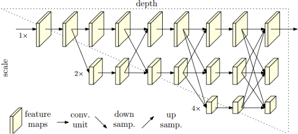

##### 7.1.2.4 表盘上数字识别
表计中的数字读数采用PaddleOCR中的PP-OCR来实现，通过DB（Differentiable Binarization）算法实现对带有旋转的文字的识别。

PP-OCR算法流程：
- 文本检测：将文本检测转化为可微分的二值化分割任务，实现了端到端的文本区域检测与边界细化
- 文本校正：在检测到图像中的文本后对文本进行校正
- 文本识别：使用SVTR（Scene Text Recognition with a Single Visual Model）算法对文本进行识别

SVTR算法特点：
- 单一视觉模型：摒弃了传统的视觉模型与序列模型相结合的复杂架构
- patch-wise框架：采用基于patch-wise图像分块的框架，将图像文本分解为小的字符组件
- 多粒度特征提取：通过多阶段的混合、合并和组合操作来提取多粒度的字符特征

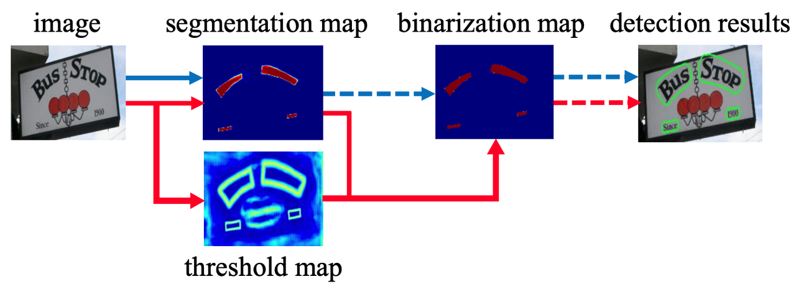
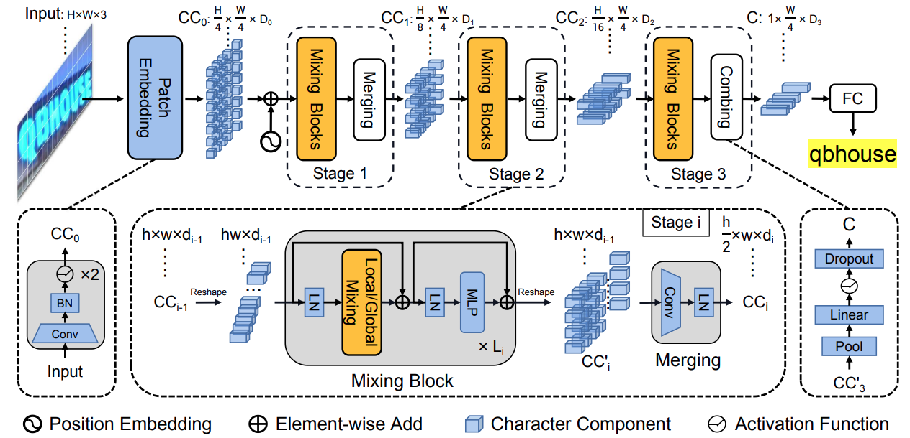

#### 7.1.3 模型的训练与优化
模型的训练与优化采用持续学习的迭代优化策略：

初始训练阶段：
- 对每种样式的表计进行视频录制
- 视频抽帧后进行人工标注
- 训练调优相关的模型

持续优化阶段：
- 调优后的模型部署到现场进行使用
- 在使用过程中不断积累识别的图像数据
- 定期对现场数据进行回流
- 使用模型对回流数据进行推理得到带有预标注的图像数据
- 经过人工复核后用于模型的调优迭代

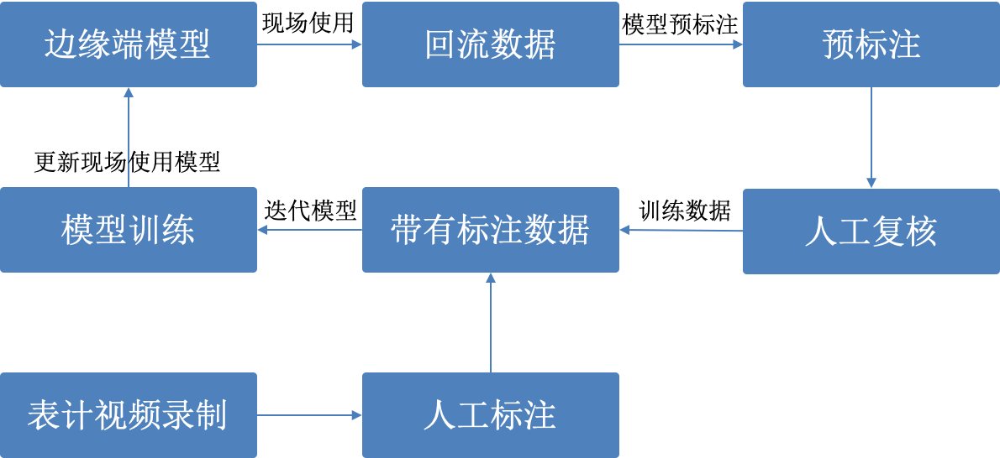

#### 7.1.4 效果验证
系统在多种类型的指针式仪表上进行了测试验证，包括压力表、温度表、流量表等不同类型仪表，在不同光照条件、角度和环境下均表现出良好的识别效果。

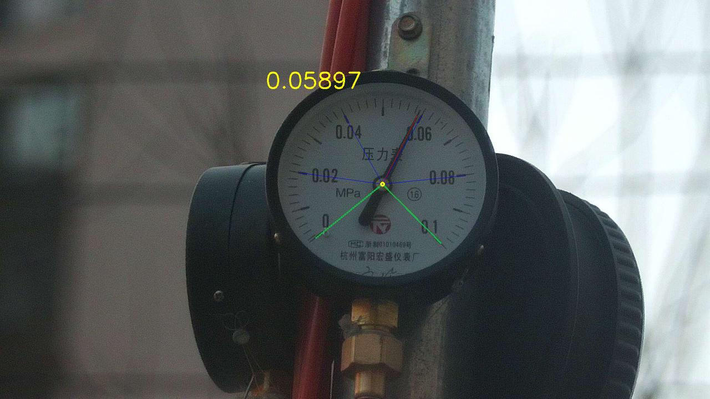
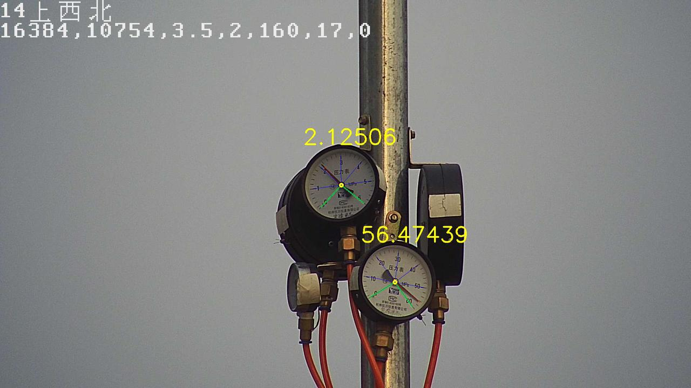
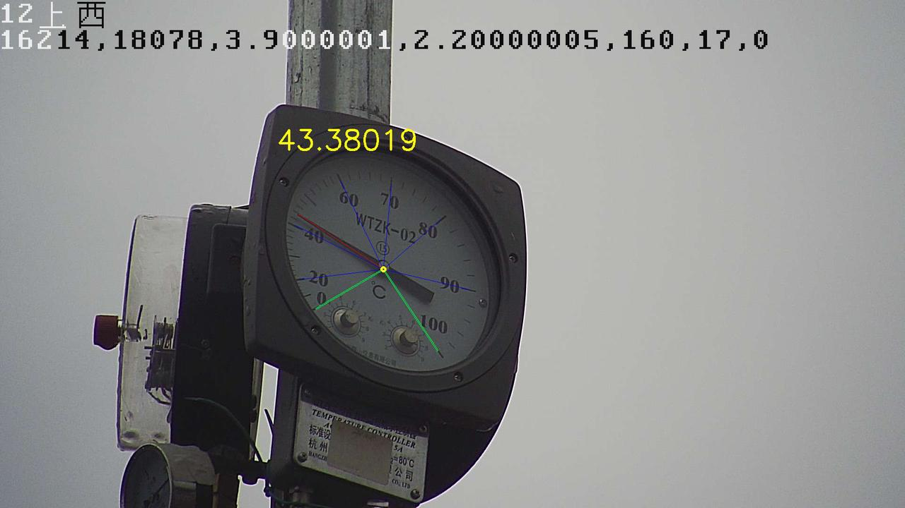
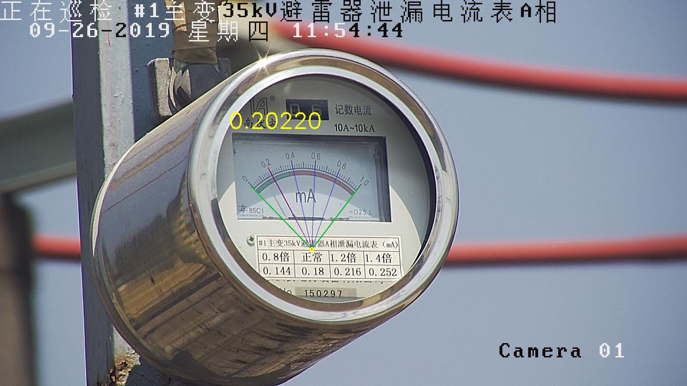
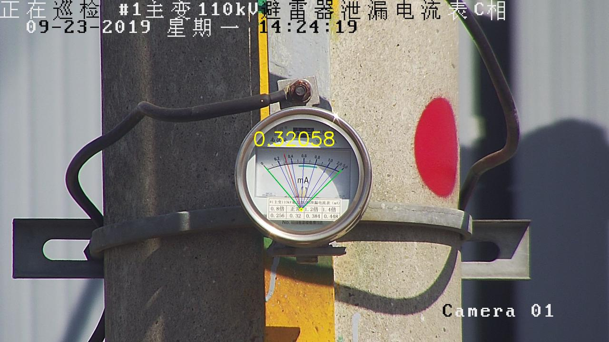
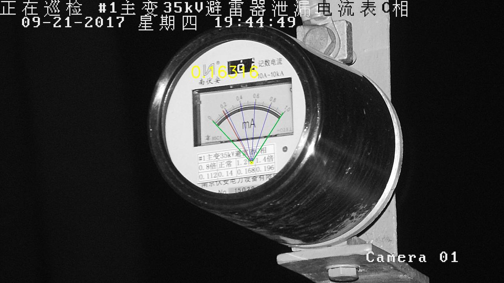
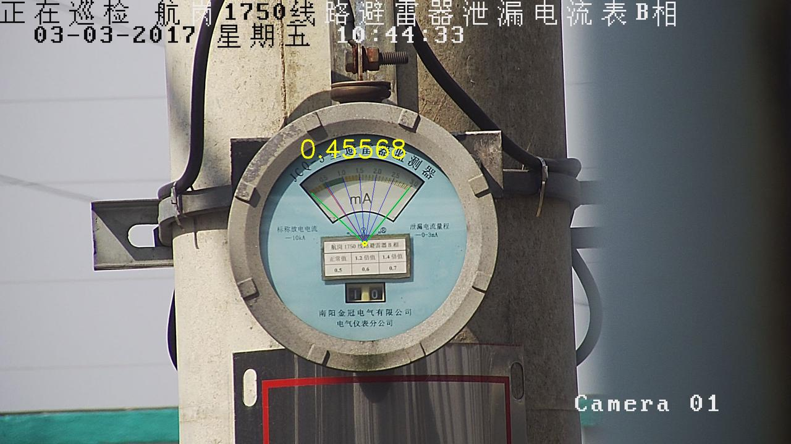
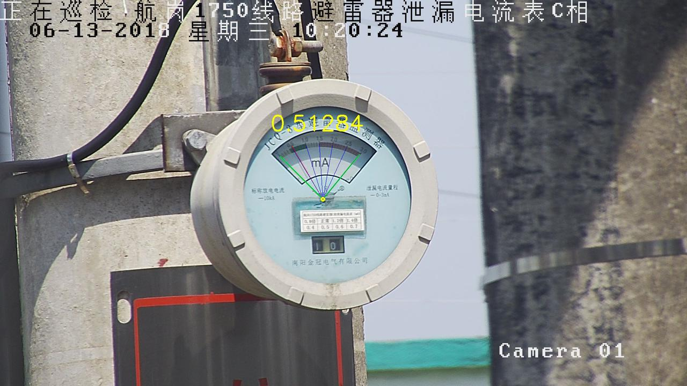
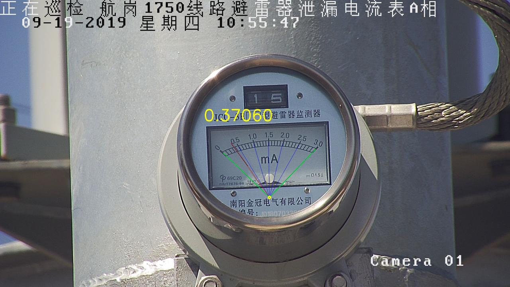


### 7.2 多模态大模型数据辅助校验算法

#### 7.2.1 vLLM推理框架原理

vLLM（Versatile Large Language Model）是专门为大语言模型推理优化的高性能推理框架，具有以下核心特点：

架构优势：
- PagedAttention技术：通过内存分页管理，显著提升GPU内存利用率
- 动态批处理：智能调度多个推理请求，提升并发处理能力
- 多模态支持：原生支持文本+图像的联合推理
- 高吞吐量：相比传统推理框架，推理速度提升2-24倍

多模态推理原理：
```
输入：图像 + 文本提示 → vLLM推理引擎 → 输出：结构化分析结果
```

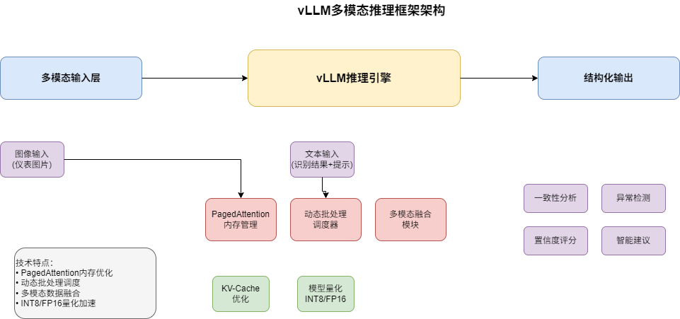

#### 7.2.2 多模态辅助校验系统架构

系统架构设计：
多模态大模型辅助校验系统采用"边缘识别+云端校验"的协同架构，实现智能化的二次验证和异常检测。

核心组件：
- 多模态输入模块：接收边缘设备的识别结果、原始图像、历史数据
- vLLM推理引擎：基于大模型进行多模态推理分析
- 知识融合模块：结合领域知识进行上下文分析
- 决策输出模块：生成校验结果和智能建议

#### 7.2.3 智能校验推理流程

Stage 1: 一致性检验
```
输入：边缘识别结果 + 原始图像
处理：vLLM分析图像与识别数值的一致性
输出：识别结果 + 误差范围
```

Stage 2: 异常检测分析
```
输入：当前读数 + 历史数据 + 设备信息
处理：基于时序分析和领域知识进行异常检测
输出：异常类型 + 风险等级 + 原因分析
```

Stage 3: 智能建议生成
```
输入：分析结果 + 上下文信息
处理：生成人机交互友好的校验报告和操作建议
输出：校验结论 + 处理建议 + 置信度说明
```

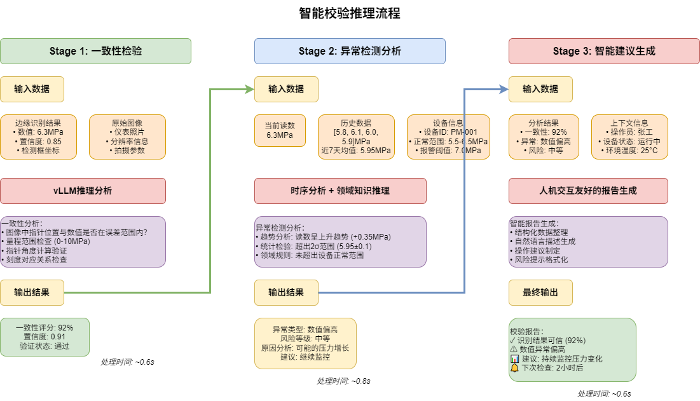

#### 7.2.4 多模态Prompt工程

视觉理解Prompt模板：
```
你是一个专业的仪表读数专家。请分析这张仪表图片：
- 仪表类型：{meter_type}
- 量程范围：{range}
- 边缘识别结果：{edge_result}

请判断：
1. 识别结果是否与图像一致？
2. 指针位置是否合理？
3. 是否存在异常情况？
```

异常检测Prompt模板：
```
基于以下信息进行异常分析：
- 当前读数：{current_value}
- 历史数据：{history_data}
- 设备信息：{device_info}
- 环境参数：{environment}

请分析是否存在异常，并说明原因。
```

#### 7.2.5 辅助校验应用场景

场景1：边缘识别置信度低
- 触发条件：边缘AI识别置信度 < 0.8
- 处理流程：多模态大模型重新分析图像和数据
- 输出结果：提供更可靠的识别结果或标记需要人工确认

场景2：数值异常检测
- 触发条件：读数超出历史正常范围或急剧变化
- 处理流程：结合历史数据和领域知识进行异常分析
- 输出结果：异常类型分类、风险评估、处理建议

场景3：图像质量评估
- 触发条件：图像模糊、光照不佳、角度偏差
- 处理流程：多模态分析图像质量对识别结果的影响
- 输出结果：图像质量评分、重拍建议、识别可信度


#### 7.2.7 辅助功能定位说明

核心定位：
- 辅助角色：作为边缘AI识别的智能助手，而非主要识别模块
- 质量提升：通过二次校验提升整体系统可靠性
- 异常预警：及时发现和标记可能存在问题的识别结果
- 决策支持：为操作人员提供专业的分析建议

不直接影响主要指标：
- 系统的核心识别精度指标（≥95%）仍基于边缘AI算法
- 多模态校验作为增值服务，提供额外的智能分析能力
- 即使多模态校验暂时不可用，系统仍能正常完成识别任务

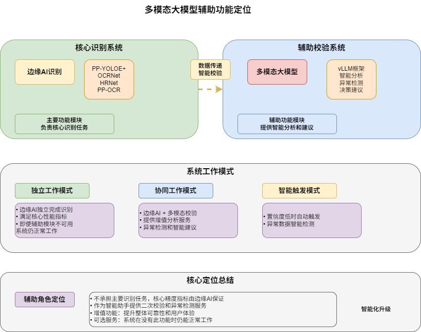

## 八、软件设计

### 8.1 终端软件设计
- todo: 功能模块划分：设计终端软件的功能模块，包括拍照、数据上传、状态监控等。
- todo: 数据交互与存储：实现手持终端拍照后，将图像数据上传至背包中的推理设备 NX，进行推理处理。随后，在规定时间内将识别结果和图片上传至后台管理系统，以便于查询和数据可视化。

### 8.2 后台管理软件设计
- todo：系统架构设计，并附上架构图
- todo：用户权限与安全，并展示效果图
- todo：数据可视化设计与实现，并附上数据可视化效果图

## 九、系统性能指标

### 9.1 识别性能指标

#### 9.1.1 仪表识别准确率（≥95%）
性能要求：系统识别准确率需达到或超过95%（误差范围±4%）

#### 9.1.2 数字读数精度（±4%）
性能要求：
- 精度目标：误差在±4%以内的比例应达到或超过95%
- 误差分布特性：读数误差集中在±4%范围内，受仪表类型和环境条件的影响

当前实测表现：
- 指针式仪表识别准确率约95%（PPYOLOE-Plus检测 + OCRNet指针分割 + HRNet刻度定位 + PPOCRv3数值识别）
- 误差主要来源：图像质量、仪表老化、光照条件、指针模糊、刻度污损等
- 多模态大模型提供智能异常检测和辅助分析，不作为主要精度评估依据

精度保障措施：
- 高精度图像采集：4K分辨率摄像头，确保图像清晰度
- 多重校验机制：边缘AI识别 + 云端大模型二次校验
- 标准化校准：定期使用标准仪表进行系统校准
- 异常值检测：自动识别并标记超出合理范围的读数
- 持续优化计划：通过算法优化和数据增强逐步提升精度

#### 9.1.3 识别响应时间（≤3秒）
性能要求：从图像采集到结果输出的完整流程≤3秒

响应时间分解：
- 图像采集与传输：≤0.5秒
- 边缘设备AI推理：≤2秒
- 结果显示与反馈：≤0.5秒
- 网络延迟缓冲：预留适当时间余量


### 9.2 硬件性能指标

#### 9.2.1 设备重量控制（≤3kg）
性能要求：整套设备总重量≤3kg，便于单人携带操作

重量分配：
- 边缘计算模块：500g
- 摄像头模块：300g  
- 显示屏：400g
- 电池系统：800g
- 外壳及配件：1000g
- 总重量控制：3kg以内

#### 9.2.2 电池续航时间（≥2小时）
性能要求：连续工作2小时，待机8小时

续航保障：
- 大容量电池：15000mAh磷酸铁锂电池
- 低功耗设计：整机功耗≤20W
- 智能电源管理：根据任务负载动态调节功耗
- 快充支持：USB-C PD 45W快充，2小时充满

### 9.3 网络性能指标

#### 9.3.1 数据传输性能
局域网通信：
- 无线连接：支持手机与背包设备的无线连接，传输速度快且稳定
- 有线连接：支持手机与背包设备的有线连接，传输速度更快更稳定
- 通信范围：无线连接有效距离50米，有线连接距离100米
- 连接可靠性：连接稳定，断开后可自动重连

#### 9.3.2 离线工作能力
本地存储：512GB SSD，可存储≥10000条识别记录
离线识别：核心AI模型本地部署，支持无网络环境工作
数据同步：网络恢复后自动批量上传，支持断点续传

## 十、总结与展望

### 10.1 方案总结

#### 10.1.1 当前性能评估与改进建议

基于近万数据量的实测结果分析：

当前实测性能：
- 指针式仪表识别准确率：读数误差在±4%范围内达到95%
- 多模态大模型：提供辅助决策支持，异常检测和趋势分析（辅助功能）

#### 10.1.2 技术方案核心优势
- 高精度智能识别：采用PPYOLOE-Plus+OCRNet+HRNet+PPOCRv3融合架构，识别准确率≥95%（±4%误差范围），指针式仪表识别达到95%，显著超越传统人工巡检的准确性

- 便携式一体化设计：整机重量≤3kg，电池续航≥2小时，支持恶劣工业环境下的移动作业

- 端边云协同架构：边缘实时处理响应≤3秒 + 云端大模型二次校验，平衡性能与成本

- 离线工作能力：核心功能支持断网环境使用，网络恢复后自动数据同步- 

#### 10.1.2 预期达成目标
技术指标目标：
- 指针式仪表识别准确率≥95%（±4%误差范围）
- 识别响应时间≤3秒
- 连续工作稳定性≥2小时
- 整机重量：≤3kg

安全性目标：
- 通过远程识别减少人员现场作业时间
- 提供异常数据自动预警
- 支持危险区域远程监测

#### 10.1.3 创新点与差异化优势
多模态大模型辅助创新：
- 结合视觉识别和语言理解的智能辅助机制
- 提供异常检测、趋势分析等辅助决策支持
- 具备自学习和智能建议能力，不影响主要识别精度

便携式机械结构创新：
- 可折叠模块化设计，收纳便携
- 一体化集成手持终端、边缘计算、通信模块

端云协同架构优势：
- 边缘设备本地处理，实时响应
- 云端智能分析，复杂场景处理
- 智能资源分配，成本优化
- 敏感数据本地处理，安全性高


## 结语

便携式仪表数据智能读取装置作为工业4.0时代的重要技术产品，将有效解决传统人工巡检的痛点问题，推动工业生产向智能化、数字化方向发展。通过先进的AI技术、便携化设计和可靠的工程实现，本方案具备了良好的技术可行性和广阔的市场前景。

在技术不断进步和工业需求持续增长的双重驱动下，预期该技术方案将在工业智能化转型中发挥重要作用，为提升工业生产安全性、效率性和智能化水平贡献重要力量。


